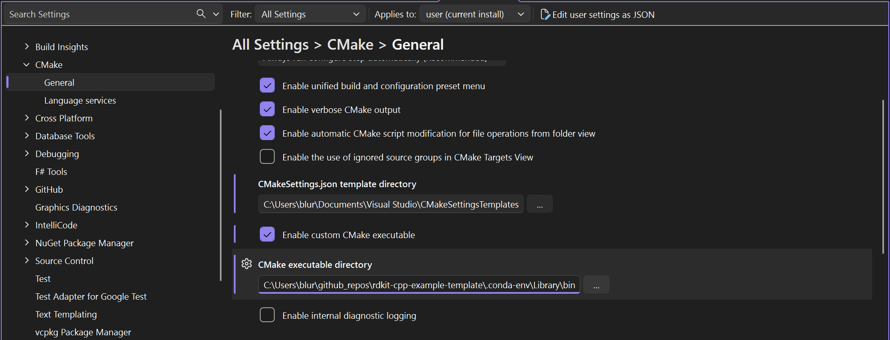

# rdkit-cpp-example-template
This repository is based on the blog post [Using the RDKit in a C++ program](https://greglandrum.github.io/rdkit-blog/posts/2021-07-24-setting-up-a-cxx-dev-env.html)
as a ready-to-clone GitHub template.

## Contents of this document
* [Prerequisite](#Prerequisite)
* [Build](#Build)
    * [From source](#From-source)
    * [Package as standalone folder](#Package-as-standalone-folder)
* [Windows specific information](#Windows-specific-information)
* [Conda related information](#Conda-related-information)
    * [Update environment](#Update-environment)
    * [Uninstall](#Uninstall)

## Prerequisite
- [Miniconda](https://www.anaconda.com/docs/getting-started/miniconda/install)
- [Visual Studio](https://visualstudio.microsoft.com/vs/community/) (for Windows builds)
- gcc (for GNU Linux)
- clang/Xcode (for macOS)

## Build

## From source
1. Create a new conda environment based on the provided `environment.yaml`:
    ```shell
    conda env create -f environment.yaml --prefix ./.conda-env
    ```
2. Activate the new conda environment:
    ```shell
    conda activate <full-file-path>\.conda-env
    ```
3. Run CMake configuration step
    ```shell
    mkdir build
    cd build
    cmake ..
    ```
4. Run CMake build step for **unix-based**:
    ```shell
    make
    ```
    or for **Windows** use:
    ```shell
    cmake --build . --config Release
    ```

### Package as standalone folder
**NOTE**: This procedure has been only tested on Windows yet. For macOS and Linux proceed with caution.

The `CMakeLists.txt` file contains a specific `install` logic that packages all DLLs/so files into the install `bin` folder.
For this run simply the `install` target.
```shell
cmake --build . --target install
```
Be sure that your current working directory is the `build/` folder and your conda environment is activated.

## Windows specific information
To develop the library or executable in Visual Studio with CMake (no Visual Studio solution!), set the CMake executable in the settings `Tools > Options > CMake > General > `  to the `cmake` binary of the conda environment.



## Conda related information

### Update environment
To update the conda environment based on the `environment.yaml` file run:
```shell
conda env update -f environment.yaml --prefix ./myenv --prune
```

### Uninstall
To remove the conda environment again run:
```shell
conda env remove --prefix ./myenv
```
